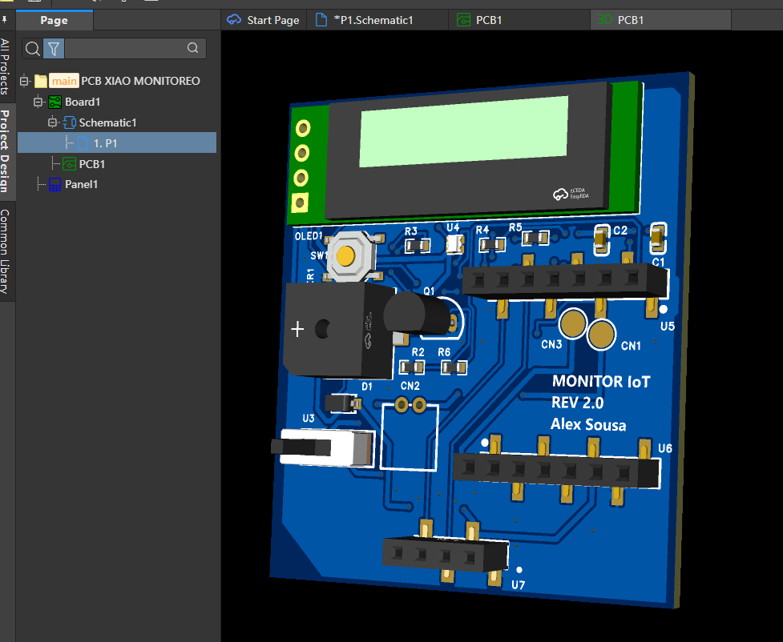
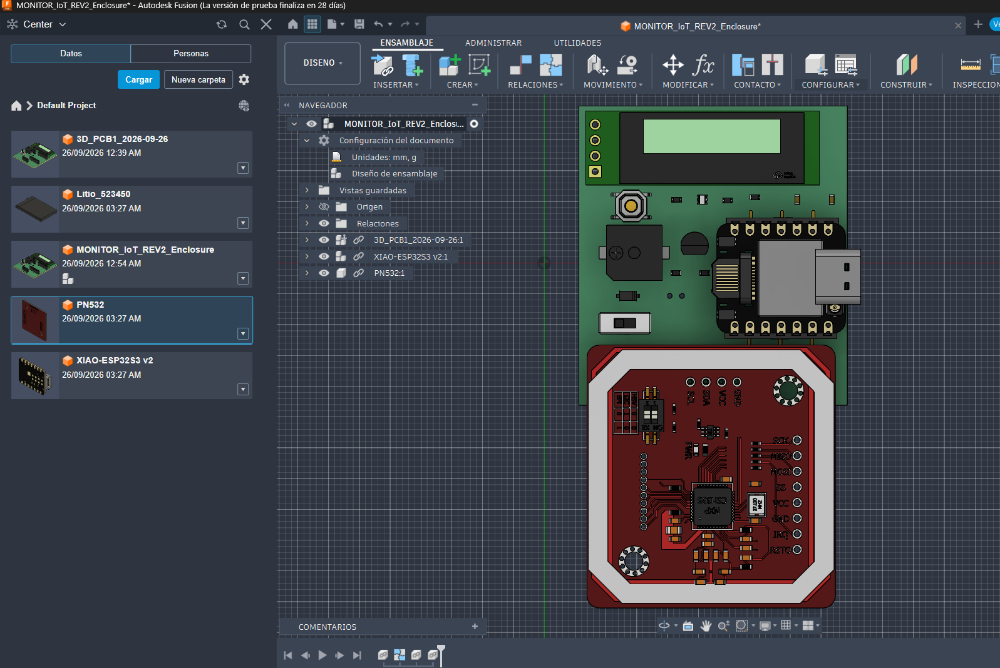

# Autonomous IoT Monitoring — REV 2.0

**Custom receiver PCB · XIAO ESP32-S3 · PN532 · Fusion 360 mechanical integration**

  
  &nbsp;&nbsp;
  

## Objective

Evolve the receiver from prototype-level wiring into a compact and maintainable custom carrier PCB while keeping development-critical modules serviceable.

## Why the architecture changed

V1 validated the monitoring concept. REV 2.0 focuses on the hardware problems that become visible after a prototype works: wiring, module replacement, packaging, connector access, enclosure constraints and maintainability.

### Removable XIAO ESP32-S3

The controller is mounted through **female headers** instead of being permanently soldered to the carrier PCB.

This decision provides replacement if a controller is damaged, reuse during development, easier debugging and firmware access, simpler servicing and flexibility for later revisions.

The mechanical assembly is also being used to preserve **USB-C access** and avoid obstructing the XIAO antenna region.

### Removable PN532 RFID module

The PN532 remains an external module through a **four-contact interface** rather than being permanently soldered to the carrier PCB.

This allows the RFID module to be replaced independently and gives more freedom to adjust its final position during enclosure development.

## PCB design

The current REV 2.0 carrier includes:

- XIAO ESP32-S3 socket interface
- I²C OLED
- RGB indicator
- transistor-driven buzzer
- local pushbutton
- LiPo / battery interface
- external PN532 interface
- top and bottom GND pours
- GND stitching vias
- two-layer routing

## Fusion 360 mechanical assembly

After completing the PCB layout, the board was brought into **Fusion 360** and assembled with 3D reference models.

The assembly is being used to review PCB-to-enclosure alignment, female-header location, XIAO removal, USB-C accessibility, antenna clearance, PN532 position, component height, battery volume and serviceability before fabrication.

Some component models are sourced as external reference CAD. They are used for spatial verification only. Critical dimensions still need to be checked against manufacturer drawings, and final fit must be validated with the real hardware.

## Current status

| Stage | Status |
|---|---|
| Schematic | Complete |
| PCB layout | Complete |
| DRC | Passed |
| Fusion 360 assembly | Documented / evolving |
| Enclosure CAD | In progress |
| Fabrication | Pending |
| Physical fit validation | Pending |
| Electrical bring-up | Pending |

## What this revision is intended to improve

REV 2.0 is not simply a smaller version of V1. It is an exercise in moving from a functional prototype toward a more maintainable embedded-hardware architecture.

The design decisions prioritize **serviceability, modularity, cleaner integration, mechanical awareness and documented validation**.

## Related repository

The complete system repository contains V1 firmware, system architecture, historical test evidence and the broader REV 2.0 documentation:

[Autonomous IoT Monitoring](https://github.com/alx-sousa/Autonomous-IoT-Monitoring)
